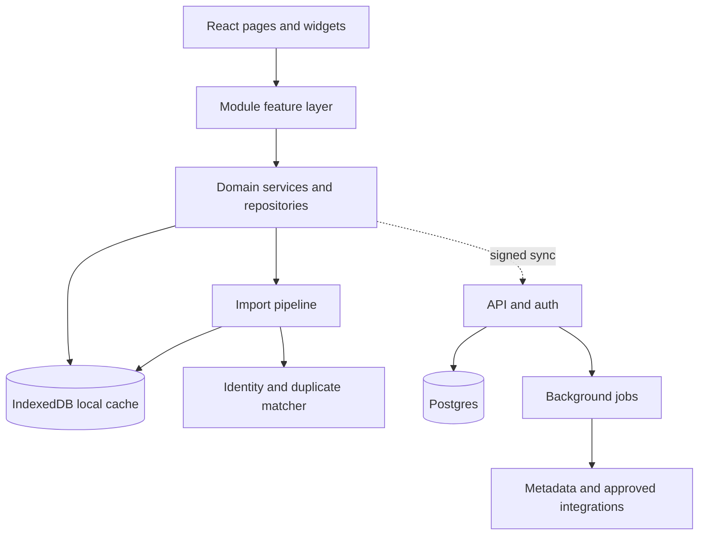

# Kaizen growth architecture

> Historical design notes. The implemented hosted/self-hosted architecture is documented in [product-architecture.md](product-architecture.md); operational setup is in [operations.md](operations.md).

Kaizen is currently a local-first React application. Each life area owns its page and Zustand store, persisted in IndexedDB, while `src/app/registry.ts` composes navigation, Today widgets, and command-palette actions. Keep that model for product speed. Add shared boundaries before adding integrations or multiple users.



## Architecture decisions

### Preserve local-first behavior

The app should remain fully useful before sign-in, offline, and on a new device. IndexedDB stays the immediate read/write model. A future server synchronizes domain records; it must not become a requirement for creating a task, logging a habit, or recording a reading session.

Each record should receive stable fields shared by every module:

- `id`, `createdAt`, `updatedAt`, `deletedAt`
- `ownerId` once accounts exist
- `version` or `updatedAt` for conflict handling
- `source` and `sourceRef` for imported data

Use soft deletion and an append-only `ImportRun` audit record for external changes. This makes imports repeatable, explainable, and reversible.

### Add a domain-service layer before a backend

Pages should stop reaching directly into persistent stores for complex operations. Retain Zustand as a UI-facing cache, but place cross-cutting actions behind services such as:

- `libraryService.addBook`, `mergeBooks`, `recordProgress`
- `importService.preview`, `commit`, `undo`
- `metadataService.lookupByIsbn`
- `syncService.push`, `pull`, `resolveConflict`

This keeps the existing UI quick to change while making the same operations usable from importers, mobile clients, background jobs, and a future API.

### Treat integrations as adapters

No page should know the transport or file format of an outside provider. Define a small adapter contract:

```ts
type ImportAdapter<TPreview> = {
  id: string;
  label: string;
  accept: string[];
  preview(file: File): Promise<TPreview>;
  commit(preview: TPreview, choices: ImportChoices): Promise<ImportResult>;
};
```

The shared import pipeline validates input, normalizes records, detects duplicates, presents a preview, commits changes in a transaction, and stores an `ImportRun`. Provider-specific parsers stay inside their own adapter folders.

### Add cloud capabilities in stages

When multiple people need access, introduce a TypeScript API, Postgres, object storage for upload artifacts, and a job queue for slow metadata enrichment. Keep secrets and provider credentials server-side. The web client only receives scoped sessions and signed upload URLs.

Use optimistic writes locally, then sync in the background. Start with last-write-wins plus a conflict inbox for fields that matter, such as a book’s status, reading position, notes, and highlights. Avoid real-time collaboration until shared spaces are an explicit product need.

## Page growth map

| Area | Near-term product growth | Shared architecture it needs |
| --- | --- | --- |
| Today | Daily templates, agenda blocks, weekly review, insight cards | Query-only daily summary service; configurable widget registry |
| Tasks | Recurrence, projects, calendar view, delegation, reminders | Task recurrence engine, notification scheduler, shared project membership |
| Studio | Content calendar, briefs, publishing checklist, performance snapshots | Content provider adapters, scheduled jobs, analytics time-series store |
| Health | Routines, measurements, wearable import, trends | Typed metric schema, time-series events, privacy controls |
| Library | Kindle imports, scanning, annotations, reading analytics | Import pipeline, book identity matcher, annotation model, metadata adapter |
| Feed | RSS subscriptions, highlights, read-later, recommendations | Feed fetch worker, source credentials, item de-duplication and enrichment |
| Settings | Accounts, data portability, import history, connected services | Auth, export/import, integration permissions, audit log |

## Library: Kindle import plan

Build Kindle support around reader-owned files and explicit user uploads. Do not depend on an unofficial Amazon account scraper.

### First release: Kindle clippings import

Accept a `My Clippings.txt` upload. Parse each entry into a normalized annotation:

```ts
type ReadingAnnotation = {
  id: string;
  bookId: string;
  kind: 'highlight' | 'note' | 'bookmark';
  text?: string;
  location?: string;
  source: 'kindle-clippings';
  sourceRef: string;
  importedAt: string;
};
```

The importer should:

1. Parse title, author, annotation type, location, timestamp, and body.
2. Match an existing book by ISBN when available, then normalized title plus author.
3. Present unmatched titles as a review queue, where the reader can create, link, or skip each book.
4. De-duplicate annotations using a hash of source book, location, type, and text.
5. Save an import run so the upload can be safely repeated or undone.

Kindle sync stores reading position, notes, and highlights across signed-in Kindle devices, so a local clippings importer should be positioned as a file-based import rather than live account sync. [Amazon Kindle sync help](https://digprjsurvey.amazon.com/csad/help/node/GGFEXXS8Z7DPJSTN)

### Second release: library and metadata import

Offer CSV import with a documented template: title, author, ISBN, pages, status, shelf, started date, finished date, and rating. Reuse the same preview and matching workflow. This solves Kindle-adjacent exports, StoryGraph/Goodreads migrations, and hand-built spreadsheets with one feature.

### Third release: scan-to-add on mobile

Add a `Scan ISBN` action that opens the phone camera only after the reader taps it. Use the browser `BarcodeDetector` capability where available, with a manual ISBN entry fallback. Scanning produces an ISBN and hands off to the existing metadata and quick-add services; it does not need its own book-creation logic.

### Later: connected Kindle options

Evaluate official Amazon export or account APIs only if Amazon offers a stable, permitted reader-library integration. If no supported API exists, keep imports file-based and transparent. Amazon documents that Kindle sync backs up reading position, notes, and highlights, but this is not a public third-party library API. [Amazon Kindle sync help](https://digprjsurvey.amazon.com/csad/help/node/GGFEXXS8Z7DPJSTN)

## Delivery sequence

### Foundation — next

1. Add repository/service interfaces around the existing stores.
2. Create the shared import center with preview, validation, duplicate resolution, and import history.
3. Move ISBN metadata lookup behind a metadata adapter with cache and source attribution.
4. Add error boundaries, migration versions, and automated import/parser tests.

### Library import MVP

1. Ship CSV import first to prove the pipeline.
2. Add `My Clippings.txt` parsing and the unmatched-book review queue.
3. Add annotation browsing and per-book highlights.
4. Add phone barcode scanning using the same ISBN quick-add flow.

### Multi-user readiness

1. Add authentication and account-scoped Postgres persistence.
2. Synchronize local records and expose import history across devices.
3. Run metadata enrichment and feed refreshes in background jobs.
4. Add observability, backups, rate limits, and per-integration consent controls.

## Success criteria

- A reader can import a file twice without creating duplicates.
- Every imported book or annotation exposes its source and can be undone by import run.
- The app remains usable offline and syncs when it reconnects.
- Page features call services, not provider APIs or IndexedDB directly.
- New integrations arrive as adapters without changing page components or core domain models.
